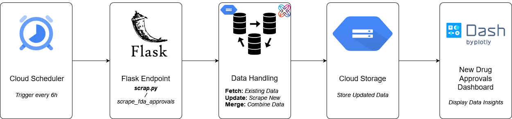

# 📊 New Drug Approvals Dashboard

An interactive dashboard developed with Dash by Plotly, which visualizes up-to-date information on newly approved drugs. The dashboard **autonomously updates every 6 hours through a fully automated scraper** that manages data retrieval and storage, ensuring the information is always current without any manual intervention.
## 🌍 Live Application

Explore the live dashboard [here](https://new-drug-approvals-app-df4l72nuga-uc.a.run.app/).

## 🖼️ Dashboard Previews

## 🧩 Project Overview

### 🔄 Data Pipeline
The project features a comprehensive data pipeline that automatically updates the dashboard. Data is scraped, cleaned, and normalized using a dedicated scraper package. The scraper is executed via a Flask route, triggered by a Google Cloud Scheduler job, emphasizing a streamlined, automated workflow.

### 🤖 Automated Data Scraper
A Flask application houses a GET route which is triggered every 6 hours by a Google Cloud Scheduler job. This setup initiates the scraper to fetch only new data, minimizing resource usage and ensuring data freshness. For a detailed understanding of the scraper's workings and to view the source code, refer to the [dedicated repository](https://github.com/Tanguy9862/scraper-new-drug-approvals).

### 📁 Data Storage and Logging
Updated data is stored in Google Cloud Storage (GCS), and the system maintains logs to track the data update processes and any potential issues during the scraping. This not only aids in monitoring but also in debugging and maintaining data integrity.

### 🌐 Dash Application
The frontend of the project is a Dash application that serves the visual representation of the data. It is updated dynamically as new data is pushed to GCS, providing real-time insights into drug approvals.

### 📦 Containerization
The project uses Docker containers to ensure that both the dashboard and the scraper have isolated environments, simplifying deployment and scaling. Different Dockerfiles are provided for each component to support this architecture.

### 🔐 Security and Automation
The scraper is securely triggered using OIDC tokens, ensuring that the scraping process is protected against unauthorized access.

## 🛠️ Installation & Setup
The system is designed for flexibility in deployment:
- **Local Setup:** Clone the repository, install dependencies from `requirements.txt`, and run locally.
- **Cloud Deployment:** For deploying on Google Cloud Platform (GCP), modify the `config.py` to fit your GCP configurations. Ensure appropriate permissions are set for GCS access and Secret Manager where API keys are stored.

## 📂 Repository Structure
- `app.py`: Entry point for the Dash application.
- `scrap.py`: Contains the Flask route and scraping logic.
- `config.py`: Configuration file for GCP and other settings.
- `Dockerfile` & `Dockerfile.scraper`: Docker configurations for the application and scraper.
- `assets/`, `layouts/`, `pages/`, `utils/`: Directories containing CSS, layouts, modular components, and utility scripts for the Dash app.
