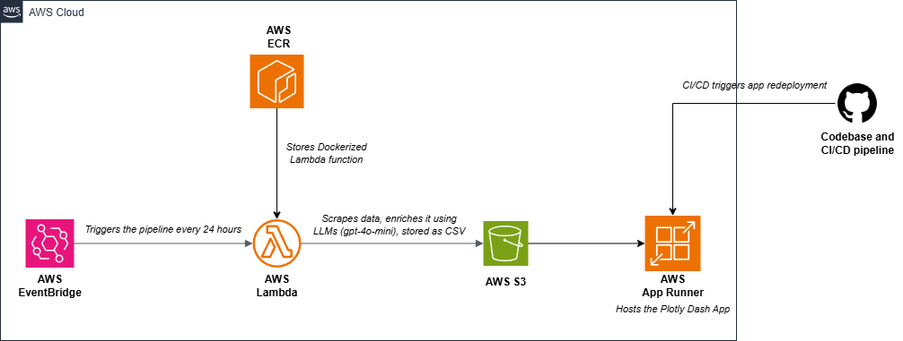

# 📊 New Drug Approvals Dashboard

An interactive dashboard developed with Dash by Plotly, which visualizes up-to-date information on newly approved drugs. The dashboard **autonomously updates every 24 hours through a fully automated scraper** that manages data retrieval and storage, ensuring the information is always current without any manual intervention.
## 🌍 Live Application

Explore the live dashboard [here](https://mbmfigdadj.us-east-1.awsapprunner.com/).

## 🖼️ Dashboard Previews

## 🧩 Project Overview

### 🔄 Data Pipeline
This project features a fully **automated pipeline** leveraging AWS services to **scrape, enrich, and store pharmaceutical data**. The scraper is **containerized** and runs on **AWS Lambda**, triggered at scheduled intervals via **EventBridge**. The enriched data is then stored in **Amazon S3**, and the Dash app is hosted on **AWS App Runner**.

### 🤖 Automated Scraper with AI Enrichment
The data pipeline includes a **scraper containerized in AWS ECR**, executed by **AWS Lambda**:

- Scrapes new drug approval data from [Drugs.com](https://www.drugs.com/newdrugs-archive/2025.html).
- Uses **gpt-4o-mini** LLM to classify therapeutic classes and diseaes.
- Scheduled with AWS EventBridge every 24 hours.

For a detailed understanding of the scraper's workings and to view the source code, refer to the [dedicated repository](https://github.com/Tanguy9862/scraper-new-drug-approvals).

### 🌐 Dash Application
The dashboard is deployed on **AWS App Runner**, automatically updating when new data is pushed to **S3**.
Key features:
- ✔ Real-time insights into drug approvals.
- ✔ Interactive graphs & analytics powered by Dash/Plotly.
- ✔ Filters for disease categories, companies, and trends.

### 📦 Containerization
- App Runner hosts the Dash app, with **CI/CD** triggering a **rebuild on every GitHub push**.
- The scraper runs in a **Docker container** stored in **AWS ECR**.

## 🛠️ Installation & Setup
The system is designed for flexibility in deployment:
- **Local Setup:** Clone the repository, install dependencies from `requirements.txt`, and run locally.
- **Cloud Deployment:** For deploying on Google Cloud Platform (GCP) or Amazon Web Services (AWS), modify the `user_config.py` to fit your configurations. Ensure appropriate permissions are set.
